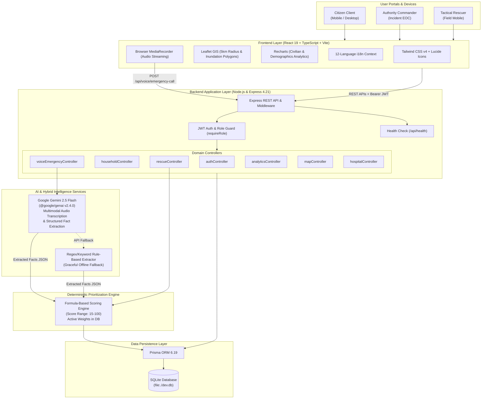

<div align="center">

# 🌊 STRIDE
### Sensor Trend Intelligence for Detection & Evaluation

**Next-Generation Disaster Management, Multi-Role Command Intelligence & Deterministic Emergency Response**

[](https://react.dev/)
[](https://www.typescriptlang.org/)
[](https://vitejs.dev/)
[](https://tailwindcss.com/)
[](https://expressjs.com/)
[](https://www.prisma.io/)
[](https://www.sqlite.org/)
[](https://ai.google.dev/)
[](https://leafletjs.com/)
[](https://github.com/advik-cs/Stride-prototype)

---

</div>

## 📌 Table of Contents

- [Executive Summary](#-executive-summary)
- [The Critical Coordination Dilemma](#-the-critical-coordination-dilemma)
- [The STRIDE Solution](#-the-stride-solution)
- [Core Architectural Principles](#-core-architectural-principles)
- [Two-Phase Disaster Lifecycle](#-two-phase-disaster-lifecycle)
- [Multi-Role Operating Framework](#-multi-role-operating-framework)
  - [1. Citizen (Civilian) Portal](#1-citizen-civilian-portal)
  - [2. Incident Command Authority Portal](#2-incident-command-authority-portal)
  - [3. Tactical Rescuer Portal](#3-tactical-rescuer-portal)
- [AI Voice Emergency Assistant](#-ai-voice-emergency-assistant)
- [Deterministic Rescue Prioritization Engine](#-deterministic-rescue-prioritization-engine)
- [Live Operational Analytics Suite](#-live-operational-analytics-suite)
- [Interactive GIS & Spatial Disaster Mapping](#-interactive-gis--spatial-disaster-mapping)
- [FLOOD-X SAR Satellite Modeling](#-flood-x-sar-satellite-modeling)
- [Hospital & Emergency Facility Telemetry](#-hospital--emergency-facility-telemetry)
- [Multilingual Accessibility (12 Languages)](#-multilingual-accessibility-12-languages)
- [System Architecture](#-system-architecture)
- [Technology Stack](#-technology-stack)
- [Repository Structure](#-repository-structure)
- [Getting Started & Local Setup](#-getting-started--local-setup)
- [Environment Variables](#-environment-variables)
- [REST API Reference](#-rest-api-reference)
- [Evaluation & Demo Credentials](#-evaluation--demo-credentials)
- [Security & Data Integrity](#-security--data-integrity)

---

## 📖 Executive Summary

Urban disasters such as sudden inundations, flash floods, and cyclonic storms overwhelm civic infrastructure within minutes. The difference between survival and mass casualty lies in the speed and accuracy of incident triage. 

**STRIDE (Sensor Trend Intelligence for Detection & Evaluation)** is an integrated disaster-management intelligence and emergency-response platform designed for high-density metropolitan ecosystems (demonstrated with live canonical data for Bengaluru, Karnataka). STRIDE connects **Citizens**, **Emergency Operations Command (Authorities)**, and **First Responders (Rescuers)** across the disaster lifecycle: from proactive household preparedness and vulnerability indexing **BEFORE** an event, to AI-assisted voice triage, deterministic priority ranking, tactical dispatch, and live civilian accountability **DURING** an active crisis.

---

## 🚨 The Critical Coordination Dilemma

Traditional disaster response operations suffer from severe systemic failure modes:

1. **Pre-Disaster Blind Spots**: Disaster agencies lack granular demographic intelligence. When flooding begins, commanders do not know which residential complexes harbor bedridden seniors, infants requiring formula, or oxygen-dependent patients.
2. **Telecommunication Chokepoints**: Emergency phone lines (e.g., 112, 100) become hopelessly congested during urban deluges. Panicked citizens cannot articulate GPS coordinates, while operators struggle to manually record notes under immense stress.
3. **The "Black-Box AI" Trap**: Relying on unconstrained generative AI to decide rescue priority introduces dangerous hallucinations, algorithmic bias, and unaccountable triage decisions in life-and-death scenarios.
4. **Information Asymmetry**: Rescuers enter flooded zones with zero visibility into water depth, trapped occupant counts, structural integrity, or real-time receiving hospital capacities.

---

## 💡 The STRIDE Solution

STRIDE solves these challenges through a unified, hybrid-intelligence architecture:

- **Mandatory Household Onboarding & Proactive Census**: Captures civilian household rosters, vulnerabilities (infants, elderly, disabled, medical dependencies), and 30-hour pre-evacuation intentions before a disaster strikes.
- **Multimodal AI Voice Assistant**: Leverages Google Gemini 2.5 Flash to transcribe spoken emergency calls in natural language, ask clarifying survival questions, and extract structured facts (headcount, water levels, injuries) without human operator bottleneck.
- **Transparent Deterministic Triage Engine**: Strips decision-making away from opaque AI algorithms. Extracted facts are evaluated by a 100% deterministic mathematical scoring model that produces auditable priority rankings with transparent factor breakdowns.
- **Real-Time GIS Command Visualizer**: Renders interactive OpenStreetMap layers featuring 5km citizen proximity zones, dynamic multi-point flood inundation polygons, real-time rescue unit positions, and shelter capacity tracking.
- **Unified Live Operational Analytics**: Equips Incident Commanders with live civilian accountability distributions (Safe / In Distress / Unaccounted), vulnerable demographic cross-sections, and immediate relief supply logistics calculations.

---

## ⚙️ Core Architectural Principles

STRIDE is engineered around four core tenets:

| Principle | Technical Implementation |
| :--- | :--- |
| **Deterministic Transparency** | AI is strictly restricted to **fact extraction and transcription**. Triage scoring, priority ranking, and dispatch queues are computed solely by auditable, rule-based mathematical formulas (`src/server/utils/priority.ts`). |
| **Role-Based Separation of Concerns** | Dedicated, authenticated portals for `CITIZEN`, `AUTHORITY`, and `RESCUER` roles, each with specialized telemetry, spatial maps, and action controls. |
| **Two-Phase Lifecycle Transition** | Clean separation between the **BEFORE** phase (preparedness, supplies, location confirmation, capacity planning) and the **DURING** phase (incident command, SOS broadcasts, live triage, dispatch). |
| **Fault-Tolerant Resilience** | Dual-tier fallback for all critical systems: if the Gemini AI API key is unavailable or rate-limited, STRIDE instantly falls back to a deterministic rule-based regex signal extractor without interrupting emergency signal creation. |

---

## 🔄 Two-Phase Disaster Lifecycle

STRIDE organizes disaster intelligence into two synchronized operational modes:

```
┌─────────────────────────────────────────────────────────────────────────────────────────┐
│                                   BEFORE PHASE                                          │
│                      (Proactive Preparedness & Logistics)                               │
├─────────────────────────────────────────────────────────────────────────────────────────┤
│ • Mandatory Citizen Household Onboarding & Vulnerability Profiling                      │
│ • Algorithmic Essentials Kit Calculator (Customized to Household Composition)           │
│ • Interactive 5km Proximity Map (Shelters, Hospitals, Hazard Basins)                   │
│ • 30-Hour Pre-Disaster Location Reconfirmation (Evacuation Intent Registry)            │
│ • Monitored Buildings Baseline Census (16 Major Urban Complexes)                        │
│ • Live Operational Weather & Meteorological Radar                                       │
└────────────────────────────────────────┬────────────────────────────────────────────────┘
                                         │
                               Disaster Event Triggered
                               (Alert Level: YELLOW/ORANGE/RED)
                                         │
                                         ▼
┌─────────────────────────────────────────────────────────────────────────────────────────┐
│                                   DURING PHASE                                          │
│                     (Real-Time Incident Command & Tactical Rescue)                      │
├─────────────────────────────────────────────────────────────────────────────────────────┤
│ • "Are You Safe?" One-Tap Civilian Status Beaconing                                     │
│ • Multimodal Voice Emergency AI Assistant (Gemini 2.5 Flash Audio Processing)           │
│ • Deterministic Rescue Prioritization Engine (Capped Score [15–100])                    │
│ • Authority Command Center: Ranked Priority Dispatch & Tactical Unit Assignment        │
│ • Rescuer Mission Lifecycle (ASSIGNED ➔ EN_ROUTE ➔ ON_SCENE ➔ RESCUED)                 │
│ • Live Operational Analytics (Civilian Accountability, Vulnerability Demographics)      │
│ • Synthetic Aperture Radar (SAR) Flood Inundation Spatial Tracking (FLOOD-X)           │
└─────────────────────────────────────────────────────────────────────────────────────────┘
```

---

## 👥 Multi-Role Operating Framework

### 1. Citizen (Civilian) Portal

Designed for stress-resilient accessibility on mobile and desktop browsers:

- **Mandatory Household Onboarding Gate**:
  - When a citizen registers or logs in, access to all operational dashboards is strictly blocked until household details are captured and verified.
  - Collects household address, GPS coordinates, member demographics (adults, children, elderly, disabled individuals), critical medical dependencies, and pet counts.
  - Automatically registers initial evacuation intentions, pre-populating incident command census registries.
- **BEFORE Phase**:
  - **Dynamic Essentials Checklist**: Automatically calculates required emergency provisions (potable water liters, non-perishable rations, first aid kits, flashlights, hygiene items) scaled to the exact size and age distribution of the household.
  - **5km Proximity Evacuation GIS**: Displays nearest designated relief shelters and hospitals within a 5-kilometer radius, including live operational status and nominal capacities.
  - **30-Hour Location Reconfirmation**: Prompts citizens prior to predicted disaster impact to confirm whether they will shelter in place (`HOME`), relocate to an official center (`SHELTER`), or evacuate outside city limits (`OTHER_CITY`).
- **DURING Phase**:
  - **One-Tap Safety Reporting**: Instantly report status as `SAFE` or `IN_DISTRESS`, updating the city-wide incident commander accountability ledger in real time.
  - **Granular SOS Beacon**: Citizens can transmit emergency signals with specific hazard condition tags (`TRAPPED`, `WATER_RISING`, `FIRE`, `HEAVILY_INJURED`, `SERIOUSLY_UNWELL`, `PHYSICALLY_DISABLED`, `CHILDREN_INFANTS_PRESENT`).
  - **Hands-Free Voice Emergency Assistant**: Speak directly into the browser to describe emergencies when manual typing or navigation is impossible.

---

### 2. Incident Command Authority Portal

Designed for Emergency Operations Centers (EOC), municipal commissioners, and disaster command staff:

- **BEFORE Phase**:
  - **Operational Weather Center**: Live meteorological telemetry (precipitation rate, wind gusts, atmospheric pressure, temperature, cloud ceiling).
  - **Baseline Building Census**: Tracks 16 primary residential complexes across high-risk flood basins in Bengaluru, detailing total registered occupants, ground-floor population, and vulnerable residents.
  - **Facility Readiness Matrix**: Real-time bed occupancy, ICU surge capacity, backup power, and oxygen reserves across metropolitan hospitals.
- **DURING Phase**:
  - **Live Command Overview**: High-level telemetry of total active rescues, available response teams, safely evacuated citizens, and critical pending incidents.
  - **Deterministic Ranked Rescue Queue**: Automatically sorts emergency calls by real-time calculated mathematical priority scores (15–100).
  - **Tactical Unit Dispatch**: One-click dispatch of specialized response teams (NDRF Aquatic Squads, SDRF Amphibious Units, KSFES Heavy Rescue, Civil Defence Boat Squads) based on team capabilities and proximity.
  - **Live Operational Analytics**: Full-width executive graphs displaying Civilian Accountability, Vulnerable Demographic Breakdowns, and Relief Supply Requirements.
  - **Monitored Buildings Census**: Track evacuation percentages and trapped occupant headcounts for every monitored complex in real time.

---

### 3. Tactical Rescuer Portal

Designed for on-the-ground first responders, boat crews, and evacuation squads:

- **DURING Phase Only**:
  - **Assigned Mission Docket**: Field teams receive direct incident assignments with precise civilian details, reported conditions, headcounts, and GPS coordinates.
  - **Four-Stage Mission State Machine**: Responders update operational status through transparent state transitions:
    $$\text{ASSIGNED} \longrightarrow \text{EN\_ROUTE} \longrightarrow \text{ON\_SCENE} \longrightarrow \text{SAFELY\_RESCUED / CANCELLED}$$
  - **Emergency Tactical Map**: Interactive routing map displaying incident locations, active flood hazard polygons, closed/flooded roadways, and nearest triage points.
  - **Live Field Analytics**: Access to district-level accountability matrices and shelter receiving statuses.

---

## 🎙️ AI Voice Emergency Assistant

When disaster victims are stranded in rising water or debris, navigating complex web forms is impossible. STRIDE integrates an end-to-end voice emergency assistant powered by **Google Gemini 2.5 Flash** (`@google/genai` v2.4.0).

```
   ┌──────────────────────┐
   │ Citizen Speaks Audio │ (WebM / WAV via MediaRecorder)
   └──────────┬───────────┘
              │ POST /api/voice/emergency-call
              ▼
   ┌─────────────────────────────────────────────────────────────┐
   │         Google Gemini 2.5 Flash Multimodal Pipeline          │
   ├─────────────────────────────────────────────────────────────┤
   │ 1. Transcribes incoming audio buffer with noise tolerance.   │
   │ 2. Context Isolation: strictly separates current speech     │
   │    from database records (eliminates hallucinated hazards).  │
   │ 3. Classifies conversational mode:                          │
   │    • ASSIST   (General queries, guidance, weather)          │
   │    • ASSESS   (Ambiguous distress -> asks 1 direct question) │
   │    • EMERGENCY(Confirmed danger -> triggers SOS payload)    │
   │ 4. Extracts structured factual JSON:                        │
   │    • peopleCount, childrenCount, elderlyCount, disabledCount │
   │    • injuredCount, criticalMedicalNeed                       │
   │    • waterLevel (LOW / MEDIUM / HIGH / EXTREME)              │
   │    • conditions (TRAPPED, FIRE, WATER_RISING, etc.)          │
   └──────────┬──────────────────────────────────────────────────┘
              │ Structured JSON Payload
              ▼
   ┌─────────────────────────────────────────────────────────────┐
   │         Deterministic Triage & Prioritization Engine        │
   │      (Computes auditable mathematical score [15 - 100])      │
   └──────────┬──────────────────────────────────────────────────┘
              │
              ▼
   ┌─────────────────────────────────────────────────────────────┐
   │ Real-Time Database Upsert & Authority Dispatch Queue Update  │
   └─────────────────────────────────────────────────────────────┘
```

### Key Engineering Safeguards

1. **Anti-Hallucination Grounding**: The system prompt strictly prohibits inferring hazards that the citizen did not mention. Active disaster alerts in the database are marked as background context and never attributed to the citizen's immediate premise unless affirmed.
2. **Deterministic Priority Handoff**: The Gemini model is **explicitly forbidden from computing priority scores**. AI extracts factual entities; the deterministic backend engine computes scores.
3. **Conversational Anti-Repetition**: Tracks dialogue state to avoid re-asking questions and asks only one direct, empathetic question at a time during high-stress interactions.
4. **Resilient Dual-Engine Fallback**: If network connectivity drops or the Gemini API is unavailable, the voice controller seamlessly routes through a deterministic keyword/regex extraction engine (`src/server/services/voiceSignalExtractor.ts`), ensuring emergency signals are never lost.

---

## 🧮 Deterministic Rescue Prioritization Engine

STRIDE rejects opaque algorithmic dispatch. Emergency request priority scores are computed via a **fully auditable, linear weighted additive model** stored in the database (`PriorityConfiguration` table) and enforced at runtime.

### The Scoring Formulation

$$\text{Priority Score} = \min\left(100, \, \text{Base} + \sum_{i=1}^{n} W(C_i) + \Delta_{\text{demographics}} + \Delta_{\text{inundation}}\right)$$

Where each condition $C_i$ contributes an independently calibrated weight $W(C_i)$:

| Condition Code | Description / Indicator | Default Weight ($W_i$) |
| :--- | :--- | :---: |
| `FIRE` | Active structural fire, gas leak, or electrical explosion | **+30** |
| `HEAVILY_INJURED` | Severe hemorrhage, trauma, head injury, or shock | **+25** |
| `SERIOUSLY_UNWELL` | Chronic medical emergency (dialysis, insulin, oxygen need) | **+20** |
| `TRAPPED` | Blocked exits, collapsed ceiling, or stranded on rooftop | **+20** |
| `WATER_RISING` | Floodwater actively rising inside the living space | **+15** |
| `NEED_RESCUE` | General urgent extraction request | **+15** |
| `CHILDREN_INFANTS_PRESENT` | Presence of infants or minor children | **+10** |
| `PHYSICALLY_DISABLED` | Non-ambulatory or sensory-impaired individuals | **+10** |
| `OTHER` | Ancillary hazards or special pet rescue requirements | **+5** |

### Water Inundation Level Adjustments

$$\Delta_{\text{inundation}} = \begin{cases} +20 & \text{if Water Level} = \text{EXTREME (Above Chest / Submerged)} \\ +15 & \text{if Water Level} = \text{HIGH (Waist Deep)} \\ +10 & \text{if Water Level} = \text{MEDIUM (Knee Deep)} \\ 0 & \text{if Water Level} = \text{LOW (Ankle Deep / Yard Only)} \end{cases}$$

### Priority Tiers & Dispatch Protocols

- 🔴 **CRITICAL (80 – 100)**: Immediate life threat. Automatic top-of-queue priority; triggers instant audible alert in Incident Command and prioritizes NDRF/SDRF boat deployment.
- 🟠 **HIGH (60 – 79)**: Severe hazard with vulnerable occupants. Dispatched as soon as immediate Critical incidents are assigned.
- 🟡 **MEDIUM (40 – 59)**: Moderate hazard or rising water without immediate medical danger. Queued for standard amphibious transport.
- 🟢 **LOW (< 40)**: Non-emergency evacuation assistance or supply delivery.

---

## 📊 Live Operational Analytics Suite

Available exclusively to **Authority** and **Rescuer** roles during active disasters, the Live Analytics suite updates via real-time polling (every 8 seconds) and features a pulsing visual status indicator (`animate-ping`).

The suite contains four specialized analytical modules:

```
┌─────────────────────────────────────────────────────────────────────────────┐
│ 🔴 Live Incident Operations | 🏛️ Authority Command Intelligence             │
│ 📊 Live Analytics                                                           │
├─────────────────────────────────────────────────────────────────────────────┤
│  [Civilian Accountability] [Building Risk Matrix] [Demographics] [Shelters] │
└─────────────────────────────────────────────────────────────────────────────┘
```

1. **Civilian Accountability Module (Full-Width)**:
   - Tracks real-time population safety across three operational states:
     - **Safe**: Registered residents who confirmed safety or reached shelters.
     - **In Distress**: Citizens with active, pending, or en-route rescue missions.
     - **Unaccounted**: Registered residents within affected zones who have not responded to safety checks.
   - Computes live percentage ratios and accountability bar graphs.
2. **Vulnerable Demographics & Supply Logistics (Full-Width Stacked Layout)**:
   - Dissects vulnerable populations across the disaster basin: **Pediatric** (0–12 yrs), **Geriatric** (60+ yrs), **Expectant Mothers**, and **Persons with Disabilities**.
   - Translates demographic data into actionable relief logistics calculations:
     - Minimum Drinking Water required (Litres/day).
     - Standard Food / Ready-to-Eat Ration Packs required.
     - Pediatric Nutrition & Infant Formula packs.
     - Critical Medical Packs (insulin, antihypertensives, clean bandages).
3. **Building Risk Matrix**:
   - Compares 16 monitored urban complexes by structural height (floors), total registered residents, flood inundation risk, and evacuation status.
   - Highlights structures with high concentrations of vulnerable residents on lower floors.
4. **Shelter Capacity Bullet Charts**:
   - Tracks nominal capacity vs. active occupancy across all designated emergency centers, preventing dangerous facility overcrowding.

---

## 🗺️ Interactive GIS & Spatial Disaster Mapping

STRIDE features an interactive geospatial mapping architecture built on **Leaflet 1.9** and styled for high-contrast emergency operations:

- **5km Citizen Proximity Buffer**: Automatically renders a 5km radius buffer around the citizen's registered coordinates, filtering relevant evacuation centers.
- **Dynamic Organic Inundation Polygons**: Multi-point GeoJSON polygons displaying flood danger zones categorized by hazard tier:
  - 🔴 **Extreme / Red Zone**: Active rapid water flow; mandatory evacuation.
  - 🟠 **High / Orange Zone**: Rising inundation; ground floors compromised.
  - 🟡 **Moderate / Yellow Zone**: Waterlogged roads; non-emergency movement restricted.
- **Real-Time Marker Clustering**:
  - Live SOS Beacons color-coded by deterministic priority tier (Critical, High, Medium, Low).
  - Tactical Rescuer Unit positions with live status badges (`AVAILABLE`, `EN_ROUTE`, `ON_SCENE`).
  - Emergency Facilities: Hospitals (bed status) and designated Shelters (occupancy).
- **Coordinate Validation Engine**: Implements strict coordinate sanity checks preventing inverted or malformed latitude/longitude coordinates from crashing map viewports.

---

## 🛰️ FLOOD-X SAR Satellite Modeling

Integrated directly into the STRIDE top-level navigation as a dedicated operational view (`FLOODX` mode):

- Embeds high-resolution **Synthetic Aperture Radar (SAR)** flood modeling.
- Enables Incident Commanders to view radar-derived flood extent overlays capable of penetrating cloud cover, heavy storm rain, and nighttime darkness.
- Provides water-depth threshold estimations and watershed runoff models for metropolitan drainage basins.

---

## 🏥 Hospital & Emergency Facility Telemetry

STRIDE provides real-time visibility into metropolitan health infrastructure:

- **Bed Capacity Telemetry**: Total available general beds, emergency triage beds, and ICU ventilator units.
- **Critical Resource Indicators**: Doctor availability on shift, liquid medical oxygen reserves, backup generator fuel autonomy, and local hospital flood status.
- **Direct Dispatch Routing**: Provides field teams and citizens with verified telephone contact lines and turn-by-turn routing coordinates.

---

## 🌐 Multilingual Accessibility (12 Languages)

Disasters affect diverse linguistic populations. STRIDE includes full internationalization (`i18n`) across **12 Indian languages**:

| Language | Code | Native Script | Coverage |
| :--- | :---: | :---: | :--- |
| **English** | `en` | English | Full UI, Portal Labels, Emergency Tags, Analytics |
| **Hindi** | `hi` | हिन्दी | Full UI, Portal Labels, Emergency Tags, Analytics |
| **Kannada** | `kn` | ಕನ್ನಡ | Full UI, Portal Labels, Emergency Tags, Analytics |
| **Tamil** | `ta` | தமிழ் | Full UI, Portal Labels, Emergency Tags, Analytics |
| **Telugu** | `te` | తెలుగు | Full UI, Portal Labels, Emergency Tags, Analytics |
| **Malayalam** | `ml` | മലയാളം | Full UI, Portal Labels, Emergency Tags, Analytics |
| **Marathi** | `mr` | मराठी | Full UI, Portal Labels, Emergency Tags, Analytics |
| **Bengali** | `bn` | বাংলা | Full UI, Portal Labels, Emergency Tags, Analytics |
| **Gujarati** | `gu` | ગુજરાતી | Full UI, Portal Labels, Emergency Tags, Analytics |
| **Punjabi** | `pa` | ਪੰਜਾਬੀ | Full UI, Portal Labels, Emergency Tags, Analytics |
| **Odia** | `or` | ଓଡ଼ିଆ | Full UI, Portal Labels, Emergency Tags, Analytics |
| **Assamese** | `as` | অসমীয়া | Full UI, Portal Labels, Emergency Tags, Analytics |

---

## 🏗️ System Architecture



---

## 🛠️ Technology Stack

| Domain | Technology | Version | Purpose |
| :--- | :--- | :---: | :--- |
| **Frontend Framework** | React | 19.0.1 | Modern concurrent UI architecture |
| **Type Safety** | TypeScript | ~5.8.2 | End-to-end type integrity |
| **Build Tooling** | Vite | 6.2.3 | Lightning-fast development & HMR |
| **CSS & Styling** | Tailwind CSS | 4.1.14 | Performance-first atomic utility design |
| **Icons & Visuals** | Lucide React | 0.546.0 | Semantic emergency UI icons |
| **Interactive GIS** | Leaflet | 1.9.4 | Open-source mobile-friendly interactive maps |
| **Data Visualization** | Recharts | 3.10.1 | Composable declarative SVG analytical charts |
| **Motion & Transitions** | Motion | 12.23.24 | Smooth visual status transitions |
| **Backend Framework** | Express | 4.21.2 | High-performance REST application server |
| **Execution Runtime** | Node.js / tsx | 22.x / 4.21.0 | Fast native TypeScript server execution |
| **Bundling Engine** | esbuild | 0.25.0 | High-speed production server bundling |
| **Database ORM** | Prisma | 6.19.3 | Type-safe query engine & schema migrations |
| **Relational Database** | SQLite | 3.x | Embedded, zero-configuration local database |
| **Generative AI** | Google GenAI SDK | 2.4.0 | Official Gemini 2.5 Flash SDK (`@google/genai`) |
| **Authentication** | JSON Web Tokens | 9.0.3 | Stateless Bearer token security (`jsonwebtoken`) |
| **Password Security** | bcryptjs | 3.0.3 | Cryptographic password hashing (10 salt rounds) |
| **Multipart Uploads** | Multer | 2.4.0 | Express middleware for browser audio uploads |

---

## 📁 Repository Structure

```
Stride-prototype/
├── api/                            # Vercel serverless entry points
│   └── index.js                    # Compiled serverless HTTP handler
├── prisma/                         # Database schema & migrations
│   ├── schema.prisma               # Prisma data models & relations
│   ├── seed.ts                     # Canonical Bengaluru source-of-truth seed
│   └── dev.db                      # Local SQLite database file
├── public/                         # Static web assets & brand marks
│   ├── favicon.svg                 # STRIDE browser favicon
│   └── stride-logo.svg             # Vector brand mark
├── src/                            # Application source code
│   ├── api/                        # Frontend API clients & fetchers
│   │   ├── authApi.ts              # Authentication & login credentials
│   │   ├── beforeApi.ts            # Preparedness & census data endpoints
│   │   ├── config.ts               # API endpoints & FLOOD-X embed config
│   │   └── duringApi.ts            # Emergency triage & dispatch API client
│   ├── components/                 # React UI component library
│   │   ├── analytics/              # Live Operational Analytics views
│   │   │   ├── BuildingAccountabilityChart.tsx
│   │   │   ├── BuildingRiskMatrix.tsx
│   │   │   ├── LiveAnalyticsView.tsx
│   │   │   ├── ShelterCapacityBulletChart.tsx
│   │   │   └── VulnerableDemographicsChart.tsx
│   │   ├── auth/                   # Authentication & role selection
│   │   │   ├── LoginPage.tsx       # 3-Way role login with demo quick-fill
│   │   │   └── ModeSelection.tsx   # BEFORE / DURING phase switchboard
│   │   ├── before/                 # Disaster Preparedness components
│   │   │   ├── BeforeDashboardView.tsx
│   │   │   ├── BeforeMapView.tsx   # 5km proximity & hazard zone map
│   │   │   ├── EssentialsView.tsx  # Dynamic essentials kit calculator
│   │   │   ├── ExpectedOccupancyView.tsx
│   │   │   ├── HouseholdMembersView.tsx
│   │   │   ├── PredictedThreatsView.tsx
│   │   │   ├── ReconfirmationView.tsx
│   │   │   └── ShelterSelectionView.tsx
│   │   ├── citizen/                # Citizen-specific components
│   │   │   └── HouseholdOnboardingGate.tsx # Mandatory household profile gate
│   │   ├── common/                 # Shared UI elements
│   │   │   ├── ErrorBoundary.tsx
│   │   │   ├── LanguageSelectorDropdown.tsx
│   │   │   ├── LiveWeatherCard.tsx
│   │   │   ├── OperationalWeatherView.tsx
│   │   │   └── StrideLogo.tsx
│   │   ├── during/                 # Real-Time Emergency Command components
│   │   │   ├── AreYouSafeView.tsx  # Citizen safety toggle & manual SOS
│   │   │   ├── DuringBuildingsView.tsx
│   │   │   ├── DuringDashboardView.tsx # Authority command center
│   │   │   ├── DuringMapView.tsx   # Live tactical GIS map with overlays
│   │   │   ├── RescueOperationsView.tsx # Rescuer dispatch & mission docket
│   │   │   └── VoiceEmergencyAssistant.tsx # Gemini-powered voice assistant
│   │   ├── floodx/                 # FLOOD-X SAR Satellite view
│   │   │   └── FloodXView.tsx
│   │   ├── hospital/               # Hospital telemetry & resource tracking
│   │   │   ├── HospitalDetails.tsx
│   │   │   ├── HospitalInformationView.tsx
│   │   │   ├── HospitalList.tsx
│   │   │   └── HospitalMap.tsx
│   │   └── layout/                 # Layout & navigation wrappers
│   │       └── DashboardLayout.tsx # Persistent header, phase & tab navigation
│   ├── i18n/                       # Internationalization system
│   │   ├── LanguageContext.tsx     # React language context & translator hook
│   │   └── locales/                # 12 Indian language translation dictionaries
│   │       ├── as.ts, bn.ts, en.ts, gu.ts, hi.ts, kn.ts...
│   ├── server/                     # Express backend implementation
│   │   ├── app.ts                  # Express application factory & route mounts
│   │   ├── config/database.ts      # Prisma client singleton
│   │   ├── controllers/            # Request handlers & triage logic
│   │   │   ├── analyticsController.ts
│   │   │   ├── authController.ts
│   │   │   ├── disasterController.ts
│   │   │   ├── emergencyController.ts
│   │   │   ├── facilityController.ts
│   │   │   ├── hospitalController.ts
│   │   │   ├── householdController.ts
│   │   │   ├── mapController.ts
│   │   │   ├── notificationController.ts
│   │   │   ├── rescueController.ts
│   │   │   ├── shelterController.ts
│   │   │   └── voiceEmergencyController.ts
│   │   ├── middleware/             # Auth guards & error handlers
│   │   │   ├── auth.ts             # JWT extraction & role validation
│   │   │   └── errorHandler.ts
│   │   ├── routes/                 # Express route definitions
│   │   ├── services/               # Core backend services
│   │   │   ├── geminiVoiceService.ts # Gemini 2.5 Flash audio integration
│   │   │   ├── strideContextService.ts
│   │   │   └── voiceSignalExtractor.ts # Rule-based fallback extractor
│   │   ├── types/                  # Shared backend type definitions
│   │   └── utils/                  # Deterministic algorithms & helpers
│   │       └── priority.ts         # Linear weighted priority scoring formula
│   ├── services/                   # Frontend client HTTP services
│   ├── App.tsx                     # Main React application component
│   ├── index.css                   # Global Tailwind v4 styles & animations
│   └── main.tsx                    # React DOM client bootstrap
├── package.json                    # Project dependencies & scripts
├── server.ts                       # Dual-mode server entry point (Vite/Node)
├── tsconfig.json                   # TypeScript compiler configuration
└── vite.config.ts                  # Vite build & bundler configuration
```

---

## 🚀 Getting Started & Local Setup

### Prerequisites

- **Node.js**: Version 18.x or higher (Node 20+ recommended)
- **npm**: Version 9.x or higher
- Modern web browser (Chrome, Edge, Firefox, Safari) with microphone permissions enabled for voice features.

### 1. Clone the Repository

```bash
git clone https://github.com/advik-cs/Stride-prototype.git
cd Stride-prototype
```

### 2. Install Dependencies

```bash
npm install
```

### 3. Configure Environment Variables

Create a `.env` file in the root directory:

```env
# Database connection string (SQLite defaults to local file)
DATABASE_URL="file:./dev.db"

# JWT secret key for session authorization
JWT_SECRET="stride-hackathon-secure-jwt-secret-key-2026"

# Google Gemini API Key (Optional but recommended for AI voice triage)
# Get a key from: https://aistudio.google.com/
GEMINI_API_KEY="your-gemini-api-key-here"

# Server Port
PORT=3000
```

> **Note**: If `GEMINI_API_KEY` is omitted, STRIDE will automatically utilize its built-in rule-based regex fallback extractor for emergency voice processing.

### 4. Initialize & Seed the Database

STRIDE uses Prisma with an embedded SQLite database. Execute the schema synchronization and canonical data seeder:

```bash
# Push the Prisma schema to dev.db
npm run prisma:push

# Generate the Prisma Client
npm run prisma:generate

# Seed the database with canonical Bengaluru source-of-truth data
npm run prisma:seed
```

### 5. Launch the Development Server

```bash
npm run dev
```

The application will start on **`http://localhost:3000`**. Both the Express API backend and Vite frontend hot-module reloading run concurrently on port 3000.

### 6. Production Build & Execution

To test the optimized production build:

```bash
# Builds frontend with Vite and bundles server with esbuild
npm run build

# Runs compiled production server
npm start
```

---

## 🔑 Environment Variables

| Variable | Required | Default Value | Description |
| :--- | :---: | :--- | :--- |
| `DATABASE_URL` | No | `file:./dev.db` | Prisma SQLite database connection string |
| `JWT_SECRET` | No | `stride-hackathon-secure-jwt-secret-key-2026` | Cryptographic secret used for signing auth tokens |
| `GEMINI_API_KEY` | Recommended | `""` (Empty) | Google Gemini API key for multimodal voice triage |
| `PORT` | No | `3000` | HTTP listening port for Express application |

---

## 📡 REST API Reference

The backend exposes a comprehensive RESTful API mounted on `/api`:

### System & Health

| Method | Endpoint | Auth | Description |
| :--- | :--- | :---: | :--- |
| `GET` | `/api/health` | Public | Returns service status, database connectivity, and timestamp |

### Authentication & Profiles

| Method | Endpoint | Auth | Description |
| :--- | :--- | :---: | :--- |
| `POST` | `/api/auth/signup` | Public | Register new Citizen or Rescuer user |
| `POST` | `/api/auth/login` | Public | Login via Mobile/Identity number + Password |
| `GET` | `/api/auth/me` | Bearer JWT | Returns current authenticated user profile & household |

### Household & Preparedness (BEFORE Phase)

| Method | Endpoint | Auth | Description |
| :--- | :--- | :---: | :--- |
| `GET` | `/api/households/my` | Bearer JWT | Retrieve citizen household profile & members |
| `POST` | `/api/households/onboarding` | Bearer JWT | Complete mandatory household onboarding gate |
| `POST` | `/api/households/reconfirmation` | Bearer JWT | Submit 30-hour pre-disaster evacuation reconfirmation |

### Emergency & Rescue Operations (DURING Phase)

| Method | Endpoint | Auth | Description |
| :--- | :--- | :---: | :--- |
| `POST` | `/api/rescue-requests` | Bearer JWT | Create manual SOS emergency request with condition tags |
| `GET` | `/api/rescue-requests/my` | Bearer JWT | Retrieve current user's active emergency beacons |
| `PATCH` | `/api/rescue-requests/:id/cancel`| Bearer JWT | Cancel active emergency request |
| `GET` | `/api/authority/rescue-requests/ranked` | Authority | Get real-time deterministic ranked rescue priority queue |
| `POST` | `/api/authority/rescue-requests/:id/assign` | Authority | Dispatch tactical rescue team to incident |
| `GET` | `/api/rescuer/missions/assigned` | Rescuer | Retrieve tactical missions assigned to current responder |
| `PATCH`| `/api/rescuer/missions/:id/status` | Rescuer | Update mission status (`EN_ROUTE`, `ON_SCENE`, `RESCUED`) |

### AI Voice Assistant

| Method | Endpoint | Auth | Description |
| :--- | :--- | :---: | :--- |
| `POST` | `/api/voice/emergency-call` | Bearer JWT | Ingests browser audio (`multipart/form-data`), transcribes via Gemini 2.5 Flash, extracts conditions, and triggers/updates SOS |
| `POST` | `/api/voice/chat-message` | Bearer JWT | Text-based fallback endpoint for the voice triage pipeline |

### Live Analytics & Telemetry

| Method | Endpoint | Auth | Description |
| :--- | :--- | :---: | :--- |
| `GET` | `/api/analytics/summary` | Authority / Rescuer | Returns live civilian accountability, demographics, and kit demands |
| `GET` | `/api/shelters` | Public | List designated shelters, locations, and real-time capacities |
| `GET` | `/api/hospitals` | Public | List hospitals, available beds, ICU units, and oxygen status |
| `GET` | `/api/map/during-data` | Bearer JWT | Spatial layers: active distress beacons, teams, and flood polygons |

---

## 🧪 Evaluation & Demo Credentials

For hackathon judges, evaluators, and reviewers, the login portal (`/login`) includes **1-Click Demo Quick-Fill Buttons** for all three roles:

| Role Portal | Identity / Mobile | Password | Key Views to Inspect |
| :--- | :--- | :--- | :--- |
| **🏛️ Incident Command (Authority)** | `AUTH-COMMAND-01` / `9800000001` | `StrongPassword123!` | • Ranked Rescue Priority Queue<br/>• Live Analytics Suite (Civilian Accountability & Logistics)<br/>• Tactical Team Dispatch<br/>• Monitored Buildings Evacuation Census |
| **🚑 Tactical Rescuer** | `RES-NDRF-88210` / `9880011223` | `StrongPassword123!` | • Assigned Rescue Mission Docket<br/>• Mission State Transitions (`EN_ROUTE` ➔ `RESCUED`)<br/>• Tactical Emergency Navigation Map<br/>• Hospital Receiving Status |
| **🏠 Citizen (Civilian)** | `5432 8901 2345` / `9800000011` | `StrongPassword123!` | • Mandatory Household Onboarding Gate<br/>• Dynamic Essentials Kit Calculator<br/>• 30-Hour Location Reconfirmation<br/>• Voice Emergency AI Assistant & SOS Beacon |

---

## 🔒 Security & Data Integrity

1. **Deterministic Accountability**: In high-stakes disaster rescue, accountability is paramount. STRIDE guarantees that no black-box AI model decides who gets rescued first. All priority scores are strictly mathematically derived from active database weights.
2. **Cryptographic Protection**: Passwords are encrypted using `bcryptjs` with 10 salt rounds. API endpoints enforce stateless JWT tokens with role-based access verification (`requireRole`).
3. **Cascading Relational Integrity**: Built on Prisma ORM with foreign-key cascade rules, preventing orphan rescue requests, unlinked status beacons, or detached household member profiles.
4. **Resilient Offline Architecture**: Embedded SQLite database requires zero external cloud database dependencies for local deployment, making STRIDE deployable on ruggedized field laptops or local command vehicles during network blackouts.

---

<div align="center">

**STRIDE — Sensor Trend Intelligence for Detection & Evaluation**  
*Built for Hackathons, Incident Commanders, First Responders, and Civilians.*

</div>
